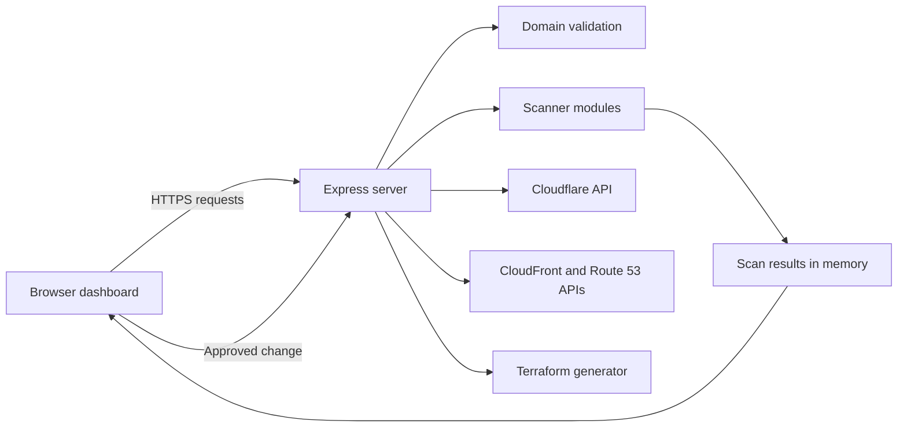

# AutoRemediate

AutoRemediate is a web security scanner with controlled remediation paths for Cloudflare, Amazon CloudFront, and Amazon Route 53. It scans a domain, shows the results in a browser dashboard, and can apply selected DNS and response-header changes when the operator has approved access to the target environment.

## Contents

- [Purpose and safe use](#purpose-and-safe-use)
- [Ethical use and legal disclaimer](#ethical-use-and-legal-disclaimer)
- [What the application does](#what-the-application-does)
- [How a scan runs](#how-a-scan-runs)
- [Screen layout](#screen-layout)
- [Architecture](#architecture)
- [Project structure](#project-structure)
- [Requirements](#requirements)
- [Install and start](#install-and-start)
- [Connect infrastructure](#connect-infrastructure)
- [Use the dashboard](#use-the-dashboard)
- [Automatic changes](#automatic-changes)
- [Add it to another application](#add-it-to-another-application)
- [API reference](#api-reference)
- [Security controls and limits](#security-controls-and-limits)
- [Troubleshooting](#troubleshooting)
- [License](#license)

## Purpose and safe use

Use AutoRemediate only on domains and cloud environments for which you have written permission. A scan sends DNS queries and HTTPS requests to the target. Some checks also request an invalid route and a malformed query value to see whether internal error details are exposed.

Do not run automatic changes until the target owner has approved the exact change. Start in a non-production environment where possible. Keep a rollback path before changing DNS or response headers.

## Ethical use and legal disclaimer

> [!WARNING]
> **LEGAL NOTICE & LIMITATION OF LIABILITY**
> 
> AutoRemediate is an educational, research, and defence security auditing framework designed strictly for authorised penetration testing, vulnerability management, and infrastructure hardening. 
>
> 1. **Authorised Scanning Only:** Scanning, probing, or modifying web infrastructure without explicit, prior written authorisation from the system asset owner is illegal and may violate national and international computer crime laws (e.g., Computer Fraud and Abuse Act - CFAA, UK Computer Misuse Act, and GDPR).
> 2. **No Liability:** The primary author(s) and project contributors assume **NO RESPONSIBILITY or LIABILITY** for any misuse, unauthorised activity, service disruption, data loss, or unlawful conduct carried out using this tool. 
> 3. **Operator Responsibility:** Users are solely responsible for ensuring their actions comply with all applicable local, state, federal, and international laws before executing any security checks or automated remediation rules.

## What the application does

AutoRemediate has four parts:

1. A browser dashboard in `public/`.
2. An Express server in `server/index.js`.
3. Scanner modules in `server/scanners/`.
4. Connector and remediation modules in `server/connectors/` and `server/remediators/`.

The dashboard accepts a domain. The server normalises the domain, runs the scanner modules at the same time, stores the scan in memory, and returns the results to the browser. The dashboard sorts the findings, shows the supporting evidence, and opens the right action for each finding.

Some findings can be changed through a connected cloud provider. Other findings receive a configuration note or a Terraform file. Server-side changes such as cookie settings, application error handling, and software-version disclosure are not changed automatically by the current code.

## How a scan runs

1. The operator enters a domain such as `example.com`.
2. The server removes a scheme, path, query string, port, trailing dot, and leading `www` from the supplied value.
3. The server rejects IP addresses, credential-bearing URLs, and invalid domain labels.
4. The scanner modules run in parallel.
5. The server adds remediation metadata to each result and stores the scan under a temporary scan ID.
6. The dashboard shows the detected infrastructure, severity totals, evidence, and available actions.
7. If the operator selects an automatic change, the dashboard asks for confirmation and sends the scan ID and finding ID to the server.
8. The server applies the matching Cloudflare, CloudFront, or Route 53 operation, then updates the finding status when the operation succeeds.

Scan and connection data live in memory. Restarting the server clears them.

## What the scanner checks

| Area | Check | How it works | Important limit |
| --- | --- | --- | --- |
| DNS TXT records | SPF, DMARC, DKIM, MX, and stale verification values | Resolves public DNS records for the domain and selected DKIM selectors. | A DNS timeout can look like a missing record. DKIM checks only `default`, `google`, `cloudflare`, and `amazonses` selectors. |
| HTTP response headers | CSP, HSTS, X-Frame-Options, X-Content-Type-Options, Referrer-Policy, Permissions-Policy, Server, and X-Powered-By | Sends an HTTPS request to the domain root and reads the response headers. | It checks the root response, not every application route. |
| TLS | Certificate presence, expiry, and negotiated protocol | Opens a TLS connection to port 443 and reads the peer certificate. | The inspection accepts an invalid certificate so that it can collect details. It does not prove that browser trust is correct. |
| Software exposure | Version information in headers, generator tags, and common public files | Reads the root response and requests `/README.md`, `/CHANGELOG.md`, and `/changelog.txt`. | A positive result needs human review before any change. |
| Error disclosure | Stack traces and verbose errors | Requests a malformed `id` query value and a non-existent route, then searches the responses for error patterns. | Use only with explicit approval. The checks are small, but they still send invalid input. |
| Cookies | `HttpOnly`, `Secure`, and `SameSite` flags | Reads `Set-Cookie` headers from the root response. | It does not sign in or inspect cookies created after a user action. |
| Subdomains | Dangling CNAME records | Checks a fixed list of common subdomains and looks for a CNAME to an inactive supported service. | It is not full subdomain discovery. The current list is in `server/scanners/subdomainEnum.js`. |

## Screen layout

The dashboard uses a dark background with blue, cyan, amber, green, and red status colours.

```text
+------------------------------------------------------------------+
| AutoRemediate v1.0                         [Settings] [Demo Mode] |
+------------------------------------------------------------------+
| Cloudflare: Connected or Not Connected | AWS: Connected or Not Connected |
+------------------------------------------------------------------+
|                   Scan. Detect. Auto-Fix.                       |
| [ example.com                                           ] [Scan] |
+------------------------------------------------------------------+
| Scan progress cards: DNS | Headers | TLS | Software | Errors     |
|                      Cookies | Subdomains                         |
+------------------------------------------------------------------+
| Infrastructure detected: target, platform, remediation path      |
+------------------------------------------------------------------+
| Findings: severity totals and individual result cards             |
| [Evidence] [Fix details] [Auto-Fix] [Export Terraform]           |
+------------------------------------------------------------------+
```

### Main areas

- **Header**: shows the product name, version, Settings button, and Demo Mode button.
- **Connection bar**: shows Cloudflare and AWS connection state.
- **Target input**: accepts a domain and starts a scan.
- **Scan grid**: shows the running scanner modules while a scan is in progress.
- **Infrastructure panel**: displays the detected hosting or edge platform and the available remediation path.
- **Findings list**: shows one card per result. A card contains the severity, a short description, raw evidence, and available actions.
- **Fix details panel**: slides in from the right. It shows the reason for the finding, the proposed change, verification steps, and rollback notes.
- **Terraform window**: lets the operator choose Cloudflare or AWS, review generated Terraform, copy it, or download a `.tf` file.

## Architecture



### Runtime flow

- `server/index.js` serves the `public/` directory and exposes the `/api` routes.
- The scan route calls the scanner modules with `Promise.allSettled`. One failed scanner does not stop the others.
- `scanCache` holds scan results by scan ID.
- `cfConnection` holds the Cloudflare token and zone lookup cache for the running process.
- `awsConnection` holds the AWS connection details and distribution lookup cache for the running process.
- The rate limiter allows 30 `/api` requests per client address in each 60-second window.

## Project structure

```text
AutoRemediate/
├── package.json
├── public/
│   ├── index.html                 Browser layout
│   ├── css/styles.css             Dashboard styling
│   └── js/
│       ├── app.js                 Main browser controller
│       ├── scanner.js             Scan progress display
│       ├── dashboard.js           Infrastructure and findings display
│       └── remediation.js         Fix details, Terraform, and change actions
└── server/
    ├── index.js                   Express routes and scan workflow
    ├── scanners/                  DNS, header, TLS, cookie, and subdomain checks
    ├── connectors/                Cloudflare and AWS API clients
    ├── remediators/               Cloudflare, CloudFront, and Route 53 changes
    ├── templates/                 Terraform and remediation metadata
    └── utils/                     Domain validation, rate limiting, and helpers
```

The running server serves `public/index.html`. The root-level `index.html`, `js/`, and `css/` copies are not the files served by `server/index.js`.

## Requirements

- Node.js 18 or later
- npm
- A modern browser
- Network access to the target domain for scanning
- A Cloudflare token only when using Cloudflare changes
- AWS access only when using CloudFront or Route 53 changes

No environment file is used by the current code. The server reads the port from `PORT` and defaults to `3000`.

## Install and start

### 1. Get the source

```bash
git clone https://github.com/Chrispel5/AutoRemediate.git
cd AutoRemediate
```

If you already have the source, open a terminal in the project directory instead.

### 2. Install packages

Use the lock file for a repeatable installation:

```bash
npm ci
```

If the lock file is not available, run:

```bash
npm install
```

### 3. Start the server

For local development:

```bash
npm run dev
```

For a normal start:

```bash
npm start
```

To use another port:

```bash
PORT=8080 npm start
```

On Windows PowerShell:

```powershell
$env:PORT = 8080
npm start
```

### 4. Open the dashboard

Open:

```text
http://localhost:3000
```

If you set `PORT`, use that port instead.

### 5. Confirm the service is running

```bash
curl http://localhost:3000/api/status
```

The response shows the Cloudflare and AWS connection states, cached scan count, and cached zone count.

## Connect infrastructure

You can scan a domain without connecting a provider. A provider connection is required only when applying a cloud change.

### Cloudflare

1. Open **Settings**.
2. Enter a token limited to the target zone.
3. Allow only the zone-read, DNS-change, and ruleset-change operations that match the changes you intend to allow.
4. Select **Connect Cloudflare**.
5. The server verifies the token through Cloudflare before marking the connection as active.

The current Cloudflare code can:

- Find a zone by domain name.
- Create, update, and delete DNS records.
- Create a response-header transform ruleset when one does not exist.
- Add a response-header rewrite rule.

### AWS

The current browser form accepts an access key ID, secret access key, and region. The server uses those values to sign AWS API calls and verifies them with `GetCallerIdentity`.

This direct-key path is suitable only for local development on a controlled machine. Do not expose the form or the connection routes to untrusted users. Do not place long-lived keys in source code, browser storage, or a shared environment.

Before a shared or production deployment, replace direct keys with an assumed role and short-lived credentials. The role should allow only the actions needed by the enabled paths:

- `sts:GetCallerIdentity`
- Route 53 hosted-zone lookup and record changes
- CloudFront distribution lookup and configuration read/update
- CloudFront response-header policy creation

Keep CloudFront and Route 53 access separate if the application does not need both.

## Use the dashboard

### Run a scan

1. Enter a domain without a path. `example.com`, `https://example.com`, and `www.example.com` all normalise to `example.com`.
2. Select **Scan Target**.
3. Wait for the scan grid to complete.
4. Review the infrastructure panel and findings cards.
5. Open raw evidence before deciding on a change.

### Read a finding card

Each card shows:

- **Severity**: Critical, High, Moderate, Low, or Pass.
- **Readiness**: whether the finding can be changed automatically, needs a generated configuration, needs more input, or needs a manual change.
- **Description**: what the check found.
- **Raw evidence**: the value returned by the scanner.
- **Actions**: available actions for that finding.

The dashboard sorts failed findings before passed findings. Failed findings are ordered from highest severity to lowest severity.

### Review a proposed change

Select the fix-details action on a finding card. Review the proposed setting, affected service, verification step, and rollback note. Do not apply a change that affects third-party assets, expected browser behaviour, or a production route until the owner has approved it.

### Use Terraform instead of an API change

Select **Export Terraform** when your infrastructure is managed as code. Choose Cloudflare or AWS, review the generated `.tf` content, then apply it through the existing infrastructure workflow. Review the generated configuration before use.

## Automatic changes

### Cloudflare DNS

The Cloudflare DNS path can create, update, or delete supported DNS records for the scanned domain. The server checks that the record name is the scanned domain or a child of it before applying the request.

Examples of supported actions include:

- Create a missing SPF or DMARC TXT record.
- Change a soft-fail SPF record to a hard-fail record.
- Change a DMARC monitoring policy to a quarantine policy.
- Remove a supported stale TXT value.
- Remove a dangling CNAME found by the subdomain check.

Review existing DNS values before applying a change. A domain may use a different provider, sender, or service configuration than the generated value expects.

### Cloudflare response headers

The Cloudflare header path creates a response-header transform rule. The rule uses the expression `true`, so it applies to all requests in the zone.

The current scanner can propose values for:

- Content-Security-Policy
- Strict-Transport-Security
- X-Frame-Options
- X-Content-Type-Options
- Referrer-Policy
- Permissions-Policy

Review each value before use. In particular, a restrictive Content-Security-Policy can block scripts, styles, fonts, images, payment pages, or other external resources used by the site.

### Amazon Route 53

The Route 53 path finds the closest matching hosted zone and submits an UPSERT or DELETE request for the supported DNS record. It waits briefly and then performs a DNS lookup for verification.

DNS caches can delay verification. A successful API response does not guarantee immediate visibility from every resolver.

### Amazon CloudFront

The CloudFront path:

1. Lists distributions and matches the scanned domain to a distribution alias or distribution domain.
2. Reads the current distribution configuration and ETag.
3. Creates a response-header policy for the selected header.
4. Adds that policy ID to the distribution's default cache behaviour.
5. Updates the distribution configuration with the ETag.

The current code changes the **default cache behaviour only**. It can replace an existing response-header policy reference on that behaviour. It also creates a policy for the selected header, not a complete copy of every existing header policy. Run this path in a non-production environment first and compare the old and new distribution settings before applying it to a live distribution.

CloudFront propagation takes time. The application returns after the API update, while edge deployment continues.

### Changes that remain manual

The current code does not automatically change:

- Application cookie flags.
- Server-side error handling.
- Web server version disclosure.
- Application or server configuration files.
- Certificate renewal.
- DNS items that need a value not available from the scan.

For these cases, use the fix details as a starting point and make the change through the owning application or infrastructure process.

## Add it to another application

### Recommended pattern

Run AutoRemediate as an internal service. Let the host application call it from its server side. Do not send provider secrets from the host application's browser to AutoRemediate.

```text
User browser
    |
    v
Host application
    |
    v
AutoRemediate service
    |
    +--> Cloudflare
    +--> AWS
```

The host application should own user authentication, target approval, and change approval. AutoRemediate should receive a validated target and only the provider access required for an approved action.

### Basic integration steps

1. Deploy AutoRemediate on an internal URL or private network.
2. Put authentication in front of the dashboard and API routes.
3. Keep provider credentials in the service environment or obtain them through an assumed role. Do not collect them in browser forms.
4. Have the host application's server call `POST /api/scan` with an approved target.
5. Display the returned `findings` array in the host application.
6. Add a server-side approval record before calling `POST /api/remediate`.
7. Keep the provider write routes separate from the scan route.

### Browser integration

The current browser files use root-relative requests such as `/api/scan`. If the dashboard and API are hosted on different origins, add one configuration value for the API base URL and use it in every browser request.

Example pattern:

```javascript
const API_BASE_URL = window.AUTO_REMEDIATE_API_BASE || '';

async function startScan(target) {
  const response = await fetch(`${API_BASE_URL}/api/scan`, {
    method: 'POST',
    headers: { 'Content-Type': 'application/json' },
    body: JSON.stringify({ target })
  });

  return response.json();
}
```

Apply the same base URL pattern in `public/js/app.js` and `public/js/remediation.js`. Restrict CORS to the host application's origin before enabling cross-origin requests.

## API reference

All write routes expect JSON. The current server applies a 30-request-per-minute rate limit to `/api` routes for each client address.

| Method and path | Purpose | Request body | Main response fields |
| --- | --- | --- | --- |
| `GET /api/status` | Shows temporary connection and cache state. | None | `cloudflareConnected`, `awsConnected`, `cachedScans`, `cachedZones` |
| `POST /api/scan` | Runs the scanner modules for a domain. | `{ "target": "example.com" }` | `scanId`, `target`, `scanTime`, `infraType`, `findings` |
| `POST /api/connect` | Verifies and holds a Cloudflare token in memory. | Cloudflare token | `success`, `message` |
| `POST /api/connect-aws` | Verifies and holds AWS connection values in memory. | AWS key ID, secret key, region | `success`, `message` |
| `POST /api/remediate` | Applies a supported change for a stored finding. | `scanId`, `findingId` | `success`, updated `finding` |
| `POST /api/terraform/export` | Generates Terraform for a stored finding. | `scanId`, `findingId`, `provider` | `filename`, `terraform` |
| `GET /api/demo` | Returns fixed sample data for a safe interface walkthrough. | None | `scanId`, `target`, `infraType`, `findings` |

### Scan request example

```bash
curl -X POST http://localhost:3000/api/scan \
  -H 'Content-Type: application/json' \
  -d '{"target":"example.com"}'
```

### Scan response shape

```json
{
  "scanId": "scan_1720000000000",
  "target": "example.com",
  "scanTime": "2026-07-22T10:00:00.000Z",
  "infraType": "cloudflare",
  "findings": [
    {
      "id": "csp-missing",
      "name": "Content-Security-Policy Header Missing",
      "severity": "HIGH",
      "status": "FAIL",
      "evidence": "Content-Security-Policy: (Not present)",
      "description": "...",
      "remediation": {
        "readiness": "auto_fixable",
        "label": "Auto-fixable"
      }
    }
  ]
}
```

## Security controls and limits

### Controls present in the current code

- Target normalisation rejects malformed domains, IP addresses, and user information in URLs.
- The DNS remediation route blocks record names outside the scanned domain.
- Cloudflare tokens and AWS connection values are held only in process memory.
- The API has a small per-client rate limit.
- The browser asks for confirmation before an automatic change.

### Controls required before a shared or production deployment

- Add user authentication and server-side authorisation to every route.
- Replace open CORS with an allowlist of approved origins.
- Replace browser-supplied provider credentials with short-lived service credentials.
- Add a server-side approval step for every write action. A browser confirmation is not access control.
- Store credentials in an approved secret store, not process memory.
- Persist scan and change state if it must survive a restart.
- Add structured event records for scans and write actions.
- Place the service behind TLS and an authenticated reverse proxy.
- Limit provider permissions to the exact zones, distributions, and actions that the service needs.

## Static site behaviour

When opened from a file URL or a GitHub Pages URL, the dashboard falls back to browser-side DNS-over-HTTPS checks and sample logic. This mode can show scan results but cannot make provider changes. Use the Express server for the full scanner and all controlled change paths.

## Troubleshooting

| Problem | Likely cause | Action |
| --- | --- | --- |
| The page does not open. | The server is not running or the port is different. | Run `npm start`, then check `http://localhost:3000/api/status`. |
| `Target domain is required` or `Enter a valid domain name`. | The input contains an unsupported value. | Enter a normal domain such as `example.com`. Do not enter an IP address, path, credentials, or query string. |
| A scanner shows an incomplete result. | DNS, TLS, or HTTPS access timed out. | Check network access and review the raw evidence. Run the scan again only if the owner approves it. |
| Cloudflare connection fails. | The token is invalid, expired, or too limited. | Create a token for the target zone with only the required read and change access, then reconnect. |
| No CloudFront distribution matches the domain. | The domain is not a distribution alias, or the role cannot list distributions. | Confirm the alias, account, and role permissions. |
| A CloudFront header change affects the site. | The response-header policy changed the default cache behaviour. | Restore the previous policy reference and review the generated policy before trying again. |
| An automatic action is unavailable. | The finding needs a manual configuration change or no provider is connected. | Open the fix details, use Terraform where available, or make the change through the owning system. |
| A scan disappears after restart. | Scan data is stored in memory. | Run a new scan or add persistent storage before deployment. |

## Development notes

- `npm run dev` uses Node's watch mode.
- No automated test command is defined in `package.json`.
- Keep scanner changes narrow and add a safe local fixture before changing detection logic.
- Keep remediation modules provider-specific. Do not place provider write code in the browser.
- Review every generated Terraform file and every provider change before use.

## License

This project is licensed under the terms of the [MIT License](file:///c:/Users/Ekundayo/Downloads/AntiAI/AutoRemediate/LICENSE). Feel free to use, modify, and distribute this software in accordance with the license conditions.
